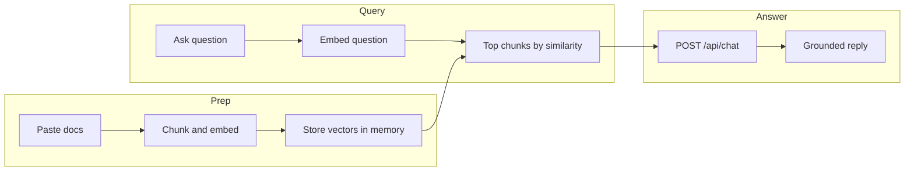

# rag-docs-app

A minimal Next.js app for **retrieval-augmented generation (RAG)** over text you paste in the browser. Bring your own OpenAI API key, load document content into memory, and chat with answers grounded in that context—no vector database and no LangChain.

## How it works

1. **Prep:** Your text is split into overlapping chunks (500 characters, 50-character overlap), each embedded with OpenAI `text-embedding-3-small`, and stored in React state as vectors.
2. **Query:** Your question is embedded in the browser. The app ranks chunks with **cosine similarity** and takes the top **3** matches.
3. **Answer:** Those chunks are assembled into a `context` string and sent with your question to a small API route that calls **`gpt-4o-mini`** with a system prompt that restricts answers to the provided documentation.



Implementation lives mostly in [`app/page.tsx`](app/page.tsx). The only server route is [`app/api/chat/route.ts`](app/api/chat/route.ts), which accepts `{ question, context, apiKey }` and proxies the chat completion (returns `{ answer }`; missing key yields `400`).

## Stack

| Piece | Choice |
| --- | --- |
| Framework | Next.js (App Router), React 19 |
| Styling | Tailwind CSS v4 |
| Embeddings | `text-embedding-3-small` (client-side `fetch` to OpenAI) |
| Chat | `gpt-4o-mini` via `openai` SDK on the server route |
| Retrieval store | In-memory React state (no DB, no files on disk for doc content) |

## Project layout

```
rag-docs-app/
├── app/
│   ├── api/chat/route.ts   # Chat completion only
│   ├── page.tsx            # UI, chunking, embedding, similarity search
│   ├── layout.tsx
│   └── globals.css
├── package.json
└── README.md
```

## Run locally

Prerequisites: [Node.js](https://nodejs.org/) and [pnpm](https://pnpm.io/).

```bash
git clone https://github.com/gavinmgrant/rag-docs-app.git
cd rag-docs-app
pnpm install
pnpm dev
```

Open [http://localhost:3000](http://localhost:3000). Enter your OpenAI API key (session memory only), paste document text, click **Load Docs**, then ask questions. Refreshing the page clears everything.

Other scripts: `pnpm build`, `pnpm start`, `pnpm lint`.

## Deploy

You do **not** need app-level environment variables for OpenAI—the UI collects the key. Connect the repo to [Vercel](https://vercel.com/) (or similar), deploy, and share the URL. Anyone using your deployment should understand they are sending their API key to **your** origin when they use chat (see below). If you publish a live demo, add its URL here so visitors know where to try the app.

## API key and privacy

- The key is kept in React state for the session and is **not** persisted by this template.
- Embeddings run from the **browser** (requests go directly to OpenAI with your key).
- **Chat** runs through **`POST /api/chat`**, so the key is sent to your server for that request—the route forwards it to OpenAI. Only deploy origins you trust, or run locally.

## Limitations

This repo is intentionally small and educational:

- **No persistence:** Refresh clears chunks and embeddings; users re-paste for a new session.
- **Sequential ingest:** Large documents embed one chunk at a time and can feel slow.
- **Naive chunking:** Fixed character windows can split mid-thought; semantic or section-based chunking is a natural upgrade.
- **No streaming:** The chat route returns the full completion at once.
- **No re-ranking:** Only cosine similarity over the top K chunks.

## Further reading

- **Article:** *Stop Letting Your Internal Docs Go to Waste, Build a RAG App* (May 2, 2026). [https://gavingrant.com/blog/stop-letting-your-internal-docs-go-to-waste-build-a-rag-app](https://gavingrant.com/blog/stop-letting-your-internal-docs-go-to-waste-build-a-rag-app)
- **Repository:** [github.com/gavinmgrant/rag-docs-app](https://github.com/gavinmgrant/rag-docs-app)

For Next.js itself, see the [Next.js documentation](https://nextjs.org/docs).
